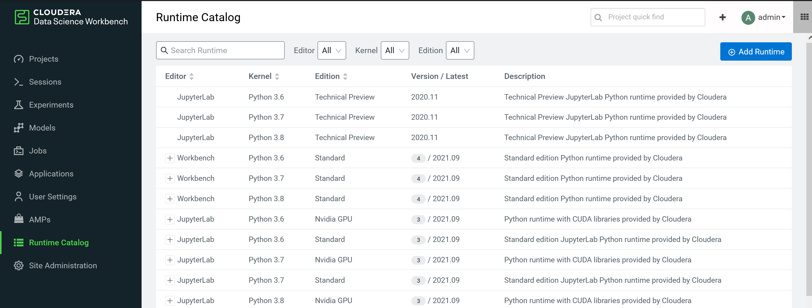
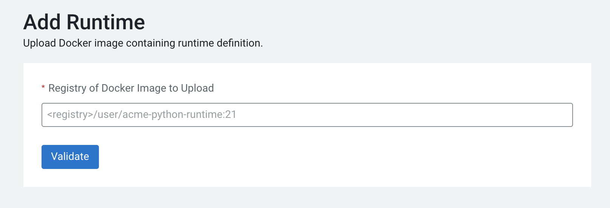
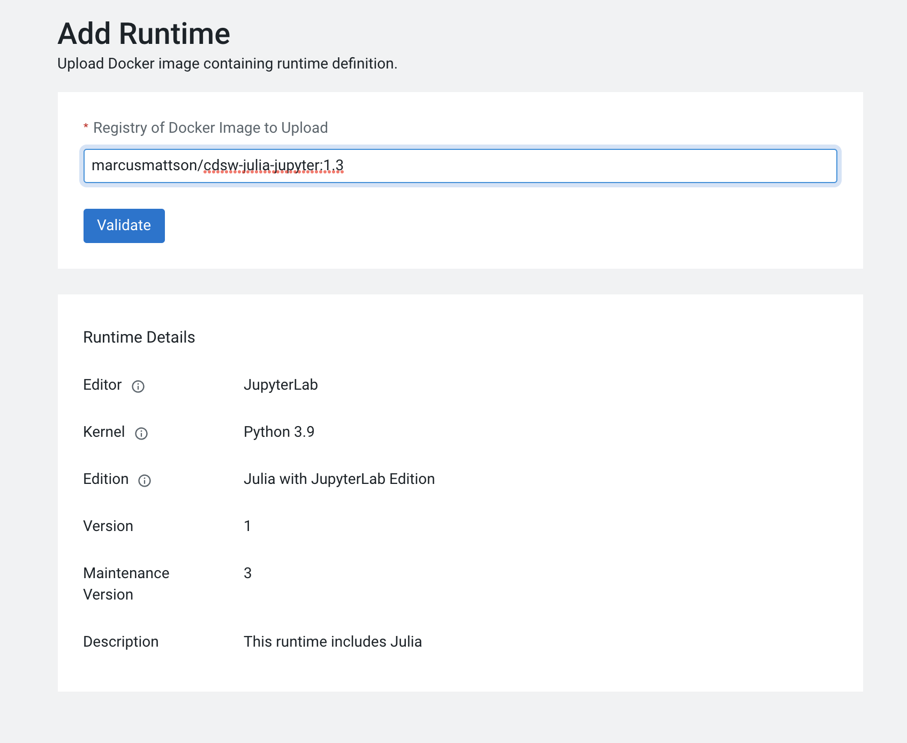

# CDSW/CML Custom Engines and Runtimes
These Dockerfiles are examples of custom engines and runtimes that can be created for use with Cloudera CDSW and CML.

## High-Level Steps
Create/modify a Dockerfile
Build Docker image
Push Docker Image to registry
Add Docker image to CDSW/CML to the ML Runtime Catalog
Test ML Runtime

Build the image
```bash
docker build --network=host -t repository_name/custom_image_name:tag . -f Dockerfile
```
## Push Docker Image to a Repository
Once the image is built, push it to a personal or organization's repository. The following is a simple example:

```bash
docker push repository_name/custom_image_name:tag
```
## Add the Custom ML Runtime 
Once the Docker image has been built and pushed, it can be added to the Runtime Catalog.


1. Select **Add Runtime**
2. **Validate** the URL for your custom runtime image
    
3. Confirm metadata and select **Add to Catalog**
    
